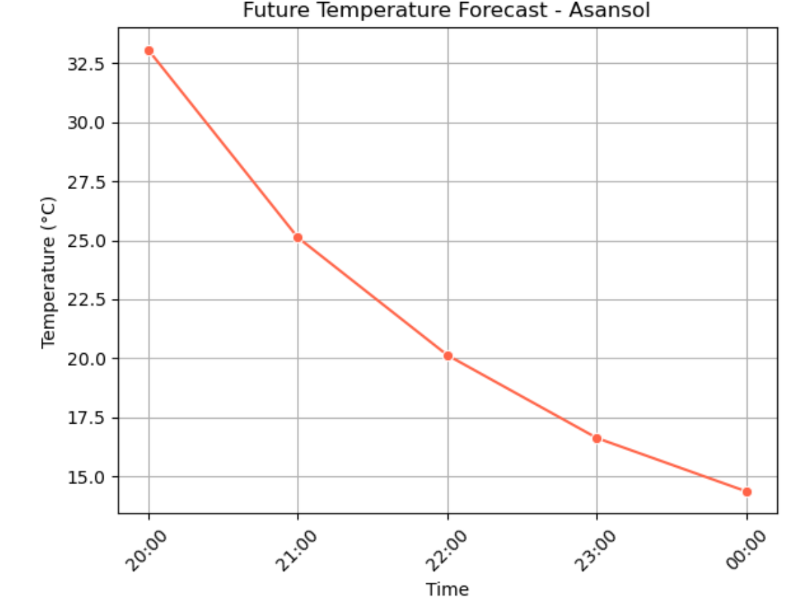
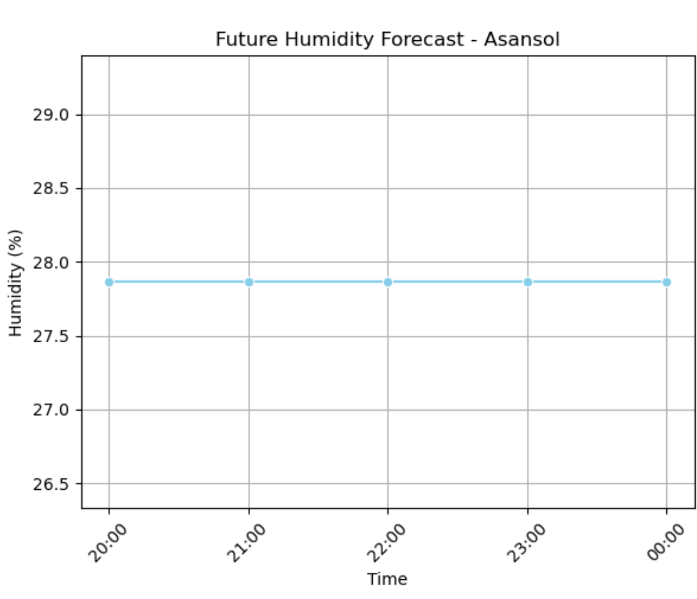

# 📈 Forecasting Applications using Deep Learning Neural Networks

This repository contains a complete implementation of a deep learning-based forecasting model developed during a research internship. The notebook focuses on building neural networks for time series forecasting using modern deep learning frameworks. The goal is to predict future values based on historical data, with applications in areas like weather forecasting, resource planning, and trend analysis.

---

## 🧠 Project Overview

The project explores forecasting techniques using deep learning, offering a hands-on demonstration of model development, training, and evaluation. It includes a streamlined workflow for time series analysis and serves as a foundation for more advanced forecasting systems.

---

## 🚀 Features

- **Time Series Preprocessing**: Handling and transforming temporal datasets for model input.
- **Neural Network Modeling**: Custom architectures built using deep learning frameworks.
- **Training and Validation**: Includes error metric evaluations like MAE, MSE, and RMSE.
- **Forecast Visualization**: In-notebook insights and result interpretation using tabular data.
- **Extensible Pipeline**: Modular notebook design makes it easy to adapt for different datasets or forecasting problems.
- **Predicted vs Actual Graphs** for temperature and humidity trends using `matplotlib` and `seaborn`.

---

## 📉 Sample Graphs

### Temperature Graph


### 📊 Humidity Graph


## 📂 Repository Structure

```bash
📁 weather-forecasting
├── main.ipynb            # Jupyter Notebook with complete implementation
├── README.md             # Project description and usage guide
